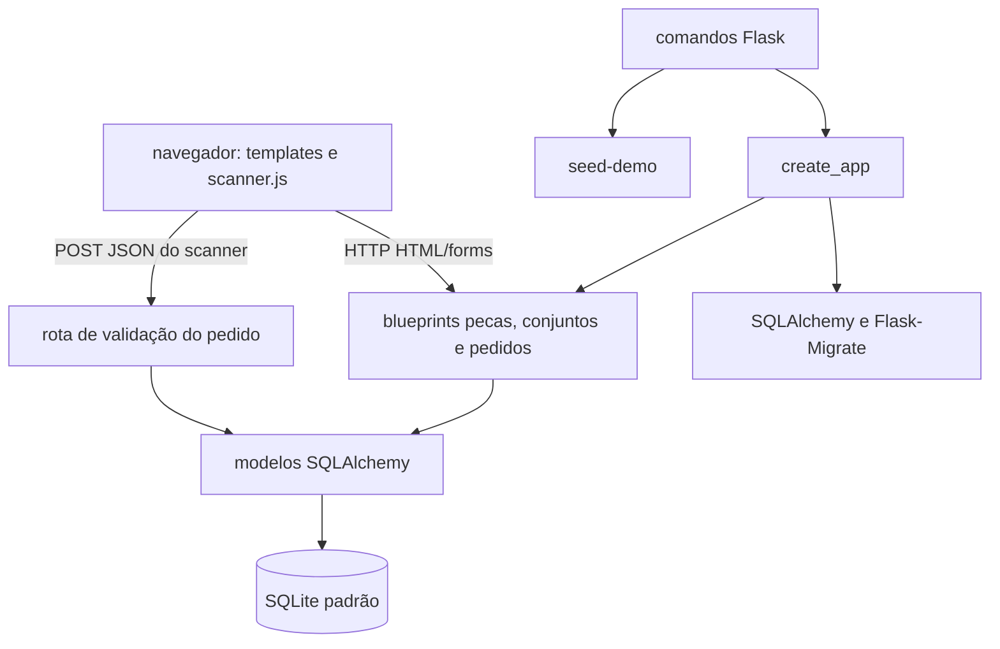

# Arquitetura

## Visão geral

A aplicação segue uma estrutura Flask modular: a fábrica inicializa extensões e registra blueprints; os blueprints processam requisições e consultam modelos SQLAlchemy; templates Jinja2 renderizam as páginas HTML. JavaScript no cliente usa uma rota JSON do scanner para enviar leituras.

## Inicialização e configuração

`app.create_app(config=None)` cria a instância Flask, exige `SECRET_KEY` no ambiente, define a URI SQLite padrão, inicializa `db` e `migrate`, importa os modelos e registra os blueprints. Uma configuração opcional pode sobrescrever valores Flask após a configuração padrão, mas a checagem da variável de ambiente ocorre antes dessa substituição.

Os modelos ficam em `app/instance/models.py`; as rotas de cada domínio ficam em `app/routers/`; os templates e arquivos do cliente ficam sob `app/templates/` e `app/static/`. A CLI registra `seed-demo`, cuja implementação fica em `app/instance/seed.py`.

## Responsabilidade dos módulos

| Local | Responsabilidade |
| --- | --- |
| `app/__init__.py` | Fábrica Flask, configuração de extensões, registro de blueprints e comando de seed. |
| `app/instance/models.py` | Entidades, relacionamentos e cálculo de progresso de pedido. |
| `app/routers/pecas.py` | Páginas e operações de gestão de peças. |
| `app/routers/conjunto.py` | Páginas e operações de conjuntos e seus itens. |
| `app/routers/pedidos.py` | Páginas e operações de pedidos, itens, scanner e validação JSON. |
| `app/templates/` | Apresentação HTML renderizada com Jinja2. |
| `app/static/` | CSS, JavaScript do scanner e biblioteca local de leitura de código de barras. |
| `migrations/` | Configuração e histórico de versões do schema via Alembic. |
| `tests/test_app.py` | Testes de fábrica, modelos, CRUD, scanner e seed com o cliente de teste Flask. |

## Fluxos principais

### Gestão HTML

O navegador envia `GET` para obter listas, formulários ou detalhes. Operações de escrita são enviadas por `POST`; as rotas validam os dados, alteram os modelos via sessão SQLAlchemy, fazem commit/rollback e retornam mensagens flash e redirecionamentos ou re-renderizam o formulário com erro.

### Leitura do scanner

O JavaScript inicia a câmera usando `html5-qrcode`, decodifica um dos formatos habilitados e envia o código para `POST /pedidos/{pedido_id}/scanner/validar`. A rota encontra a peça, verifica sua presença e quantidade no pedido, grava o resultado aplicável e retorna status e progresso em JSON. O cliente atualiza a interface com a resposta.

### Migrações e demonstração

As versões de schema estão em `migrations/versions/` e são aplicadas via Flask-Migrate. O comando `seed-demo` invoca o seed de demonstração; esse seed chama `db.create_all()` e faz upsert dos registros de demonstração que administra.

## Limites arquiteturais observados

- Lógica de apresentação, validação de formulário e parte da orquestração de negócio residem nas funções de rota.
- Não há camada de serviço separada registrada nem interface versionada de API REST.
- O banco SQLite e a ausência de autenticação são configurações/limites atuais, não uma afirmação de adequação para deploy multiusuário.
- Não existe documentação de infraestrutura, topologia de produção ou monitoramento neste repositório.
