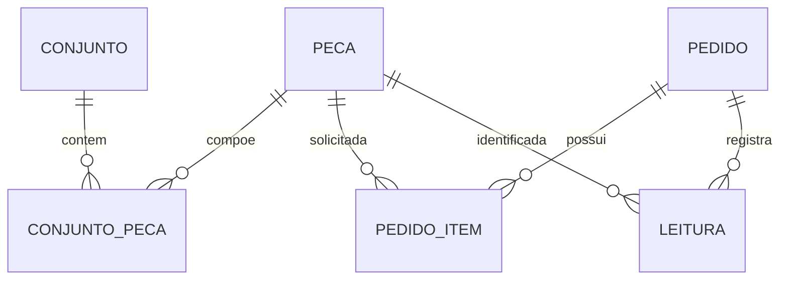

# Modelo de dados

O schema atual é definido pelos modelos SQLAlchemy em `app/instance/models.py`. A revisão inicial do banco está em `migrations/versions/9aac0ccff198_initial_schema.py`.

## Entidades e relações

| Entidade | Campos principais | Restrições/relações |
| --- | --- | --- |
| `Peca` | `id`, `codigo`, `descricao`, `codigo_barras` | `codigo` e `codigo_barras` são únicos e indexados. Relaciona-se a itens de conjuntos, itens de pedidos e leituras. |
| `Conjunto` | `id`, `codigo`, `descricao` | `codigo` é único e indexado. Seus itens são `ConjuntoPeca`. |
| `ConjuntoPeca` | `id`, `conjunto_id`, `peca_id`, `quantidade` | Chaves estrangeiras para conjunto e peça; combinação conjunto/peça única. |
| `Pedido` | `id`, `codigo` | `codigo` é único e indexado. Possui itens e leituras. |
| `PedidoItem` | `id`, `pedido_id`, `peca_id`, `quantidade_necessaria` | Chaves estrangeiras para pedido e peça; combinação pedido/peça única. |
| `Leitura` | `id`, `pedido_id`, `peca_id`, `status`, `timestamp` | Chaves estrangeiras para pedido e peça; status armazenado como Enum SQLAlchemy; timestamp recebe `datetime.utcnow` como padrão. |

## Status das leituras

O Enum Python `StatusLeitura` contém `SUCESSO`, `DUPLICADA` e `FORA_DO_PEDIDO`. A rota JSON serializa seus valores em minúsculas com sublinhados: `sucesso`, `duplicada` e `fora_do_pedido`. A migração inicial define os valores persistidos como nomes do Enum (`SUCESSO`, `DUPLICADA`, `FORA_DO_PEDIDO`).

Uma peça conhecida mas não incluída no pedido produz leitura `FORA_DO_PEDIDO`. Um código que não corresponde a peça por código de barras nem por código não cria leitura. Uma leitura além da quantidade necessária é mantida no histórico como `DUPLICADA`.

## Cálculo do progresso

`Pedido.progresso()` soma as quantidades necessárias e conta apenas as leituras de sucesso por peça. Para cada item, a quantidade validada é limitada a `min(sucessos, quantidade_necessaria)`. O resultado contém:

- `total_necessario`: soma das quantidades dos itens;
- `quantidade_validada`: soma das quantidades limitadas por item;
- `percentual`: progresso em porcentagem, arredondado a duas casas decimais;
- `status`: `sem_itens` quando o total é zero, `finalizado` quando todas as unidades necessárias foram validadas, ou `em_andamento` nos demais casos.

`Pedido.progresso_por_item()` aplica a mesma contagem/limite e devolve a peça, quantidade necessária, quantidade validada e percentual de cada item. Esses valores são calculados em memória e não persistidos como colunas.

## Integridade e ciclo de vida

As relações `Conjunto.pecas_assoc` e `Pedido.itens` usam `cascade="all, delete-orphan"` para seus itens associativos. A exclusão de pedido com leituras e de peça com associações é barrada pelas rotas da aplicação. As quantidades positivas são validadas nas rotas; o schema da migração não define restrições `CHECK` para valores positivos.
